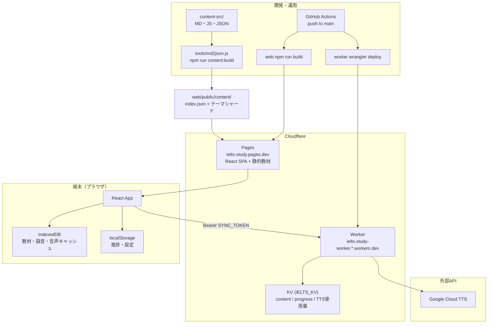
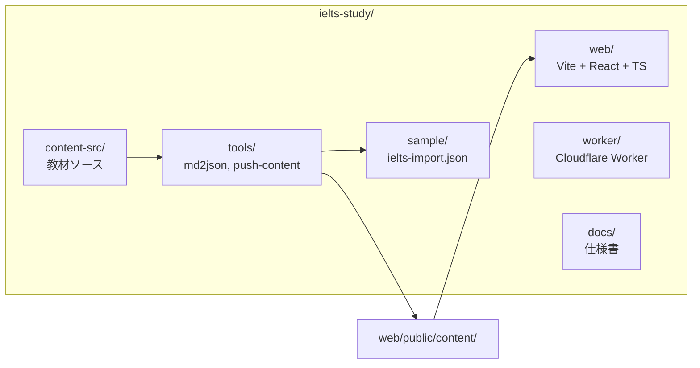
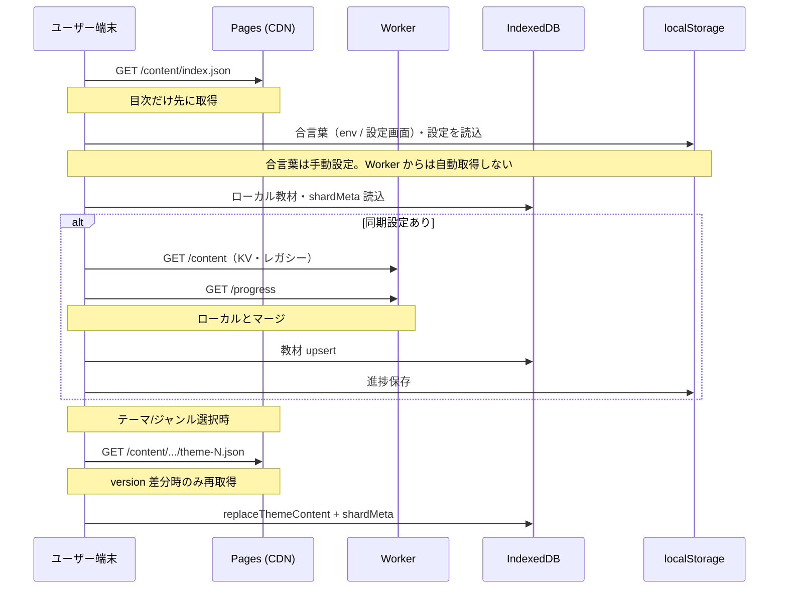
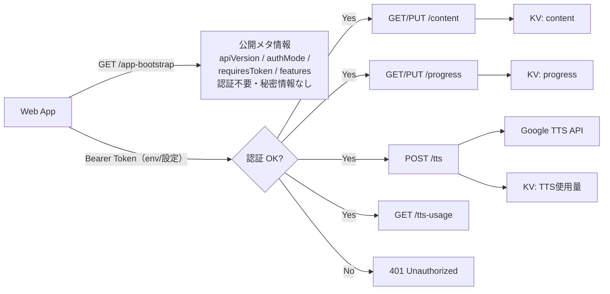
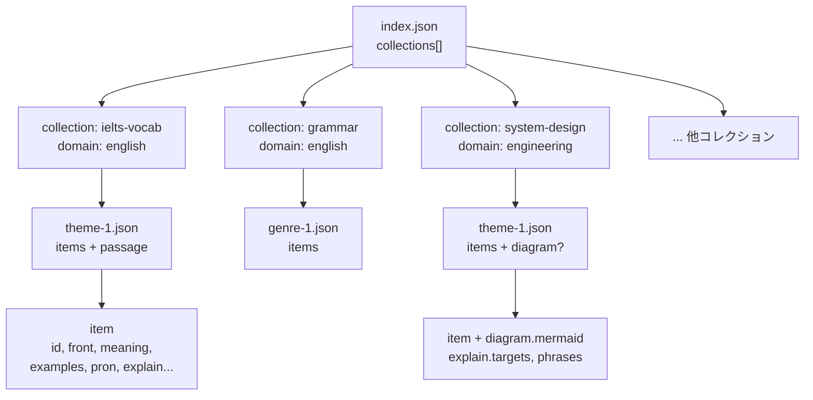
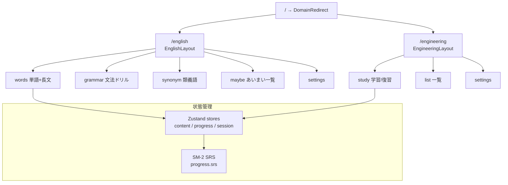
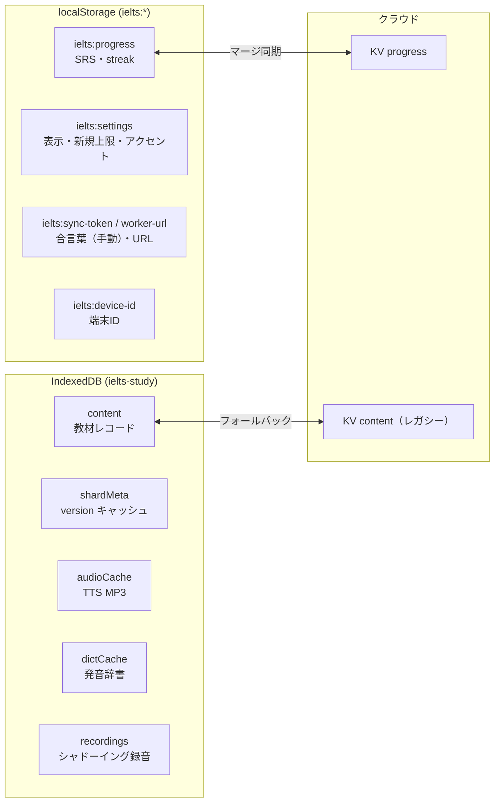
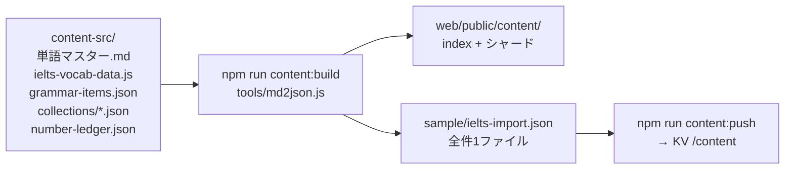
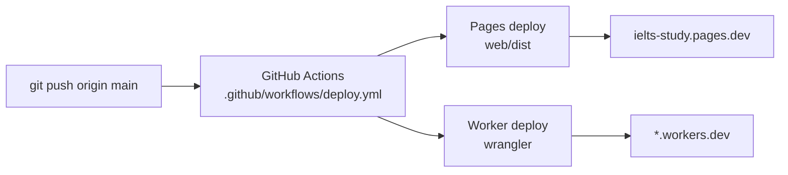

# ielts-study システム構成

個人用の **英語 + エンジニアリング学習アプリ**。フロントは **Cloudflare Pages**、API は **Cloudflare Worker + KV**、教材は **静的 JSON（CDN）**、端末側は **IndexedDB / localStorage** で動作する。

## 本番 URL（例）

| 役割 | URL |
|------|-----|
| アプリ | `https://ielts-study.pages.dev` |
| API | `https://ielts-study-worker.byung4050.workers.dev` |

---

## 1. 全体構成（本番）



| コンポーネント | 役割 |
|---|---|
| **Pages** | UI 配信 + 教材 JSON（`/content/*`）を CDN から配信 |
| **Worker** | 進捗同期、TTS プロキシ、KV 教材（レガシー）、公開メタ情報（`/app-bootstrap`） |
| **KV** | `content` / `progress` / TTS 月次使用量 |
| **端末** | オフライン用キャッシュ、録音、SRS 状態 |

---

## 2. リポジトリ構成



| ディレクトリ | 内容 |
|---|---|
| `web/` | フロント（Vite + React + TypeScript + Tailwind） |
| `worker/` | Cloudflare Worker（KV、TTS、同期 API） |
| `content-src/` | 教材ソース（MD、JS、JSON） |
| `tools/` | 教材生成・KV 反映スクリプト |
| `sample/` | 全件1ファイル（KV `/content` 互換） |
| `docs/` | 設計・仕様ドキュメント |

---

## 3. 起動時のデータフロー



### 教材取得方針（現行）

1. **起動時** → `index.json` のみ取得
2. **テーマ選択** → 該当シャードを lazy 取得
3. **`version` 差分** → 内容 MD5（8桁）が変わったときだけ再ダウンロード
4. **KV `/content`** → 起動時マージ用のフォールバック（静的 CDN への移行中）

---

## 4. Worker API



| エンドポイント | 認証 | 用途 |
|---|---|---|
| `GET /app-bootstrap` | 不要 | 公開メタ情報（`apiVersion` / `authMode` / `requiresToken` / `features`）のみ返す。`SYNC_TOKEN` 等の秘密情報は返さない |
| `GET/PUT /content` | Bearer | KV 教材の取得・保存（レガシー） |
| `GET/PUT /progress` | Bearer | 学習進捗（SRS 等）の同期 |
| `POST /tts` | Bearer | Google TTS プロキシ（MP3 返却） |
| `GET /tts-usage` | Bearer | 月次 TTS 使用量 |

---

## 5. 教材データモデル



**階層:** `domain` → `collection` → `theme` → `item`

| domain | 例 | 主な item 種別 |
|---|---|---|
| `english` | ielts-vocab, grammar | word, phrase, grammar + passage（長文） |
| `engineering` | system-design, sql-optimization 等 | concept（図解 + 英語説明ドリル） |

### 静的配信レイアウト

```
web/public/content/
  index.json                          ← 目次（collections → themes）
  english/ielts-vocab/theme-0..10.json
  english/grammar/genre-1..3.json
  engineering/system-design/theme-1.json
  engineering/.../theme-1.json
```

- `index.json` の各 theme エントリに `file`, `count`, `version` を保持
- `version` は内容ハッシュ（MD5 先頭8桁）。中身が変わらなければ再取得しない

---

## 6. アプリ UI 構成



- **English / Engineering** はヘッダで完全切替（別レイアウト・別ページ群）
- 復習は SM-2 間隔反復（`progress.srs`、item `id` をキー）
- Engineering 図解カードは Mermaid CDN で `diagram.mermaid` を SVG 描画

---

## 7. 端末内ストレージ



| 保存先 | データ | 端末間同期 |
|---|---|---|
| IndexedDB | 教材、shardMeta、TTS キャッシュ、録音 | 教材は KV フォールバックのみ |
| localStorage | 進捗（SRS）、設定、合言葉（手動）、端末ID（`ielts:*`） | 進捗は Worker KV `/progress` とマージ |
| KV | content, progress, TTS 使用量 | クラウド正 |

---

## 8. 教材ビルドパイプライン



| コマンド | 作用 |
|---|---|
| `npm run content:build` | `content-src/` → 静的 JSON + sample 生成 |
| `npm run content:push` | sample を Worker KV `/content` に PUT（要 `SYNC_TOKEN`） |
| `git push origin main` | Pages + Worker を CI 自動デプロイ |

- **本番 UI の主経路:** Pages CDN の静的 JSON
- **KV push:** レガシー互換・端末間教材マージ用

---

## 9. デプロイフロー



### ローカル開発

```bash
cd /Users/lee/Documents/ielts-study
npm run dev            # Web → http://localhost:5173
npm run dev:worker     # Worker → http://127.0.0.1:8787（TTS・同期用）
```

初回: `npm run setup` → `worker/.dev.vars` / `web/.env.local` を編集

---

## 10. 技術スタック一覧

| レイヤ | 技術 |
|---|---|
| フロント | React, Vite, TypeScript, Tailwind, Zustand, React Router |
| 配信 | Cloudflare Pages |
| API | Cloudflare Worker |
| 永続化（クラウド） | Cloudflare KV |
| 永続化（端末） | IndexedDB（idb）, localStorage |
| 教材 | 静的 JSON（lazy + version 差分キャッシュ） |
| 音声 | Worker 経由 Google Cloud TTS |
| 復習 | SM-2 間隔反復 |
| 図解（Engineering） | Mermaid（CDN 読み込み → SVG 描画） |
| CI/CD | GitHub Actions |

---

## 関連ドキュメント

- `CLAUDE.md` — 開発ガイド・データスキーマ要点
- `README.md` — セットアップ・デプロイ手順
- `docs/設計_統合学習アプリ.md` — 全体設計（IA・ストレージ・発音）
- `docs/分野切替_Engineeringページ.md` — English / Engineering 切替仕様
